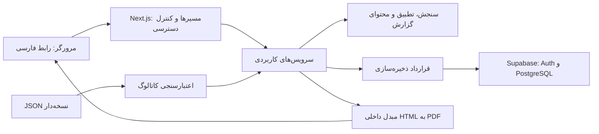

# معماری فنی

## ساختار کلان

تصمیم: یک برنامه ماژولار واحد روی Next.js با TypeScript. رابط، API و هماهنگی عملیات در یک پروژه می‌مانند؛ منطق سنجش و پیشنهاد از فریم‌ورک و دیتابیس مستقل است. این اندازه از محصول به سرویس‌های جدا، صف عمومی یا مدل یادگیری ماشین نیاز ندارد.

## مسئولیت‌ها و جهت وابستگی

| محل | مسئولیت | محدودیت |
| --- | --- | --- |
| `src/app` | صفحات، layout، ورودی HTTP و تبدیل خطا به پاسخ | فرمول امتیازدهی در این لایه نوشته نمی‌شود |
| `src/components` | اجزای عمومی رابط و دسترس‌پذیری | بدون دسترسی مستقیم به داده خصوصی |
| `src/features` | فرم آزمون و نمایش نتیجه | فقط قرارداد عمومی API را می‌شناسد |
| `src/domain` | مدل‌ها و محاسبات خالص | بدون import از React، Next.js، Supabase یا فایل‌سیستم |
| `src/server/services` | تأیید هویت، اعتبارسنجی، فراخوانی محاسبات و ثبت نتیجه | مرز عملیات سرور و تراکنش |
| `src/server/repositories` | قراردادهای خواندن و نوشتن آزمون و نتیجه | جزئیات SDK وارد قرارداد نمی‌شوند |
| `src/infrastructure` | خواندن JSON، اتصال Supabase و تولید PDF | پیاده‌سازی قراردادهای مورد نیاز سرویس‌ها |

صفحات تا جای ممکن Server Component و بخش تعاملی آزمون Client Component خواهد بود؛ این جداسازی با [مدل Server/Client در Next.js](https://nextjs.org/docs/app/getting-started/server-and-client-components) سازگار است. Server Component مستقیماً سرویس کاربردی را فراخوانی می‌کند؛ رفت‌وبرگشت HTTP داخلی لازم نیست. [راهنمای Backend for Frontend](https://nextjs.org/docs/app/guides/backend-for-frontend) مبنای این تصمیم است.

## مسیرها و عملیات برنامه‌ریزی‌شده

مسیرهای مراحل ۳ و ۴ پیاده شده‌اند؛ PDF هنوز قرارداد مرحله ۵ است. منطق فعلی Matching و وضعیت علمی در [راهنمای مرحله ۴](matching-stage4.md) ثبت شده‌اند.

| مسیر | کاربرد | مرحله |
| --- | --- | --- |
| `GET /` | اطلاعات اولیه و شروع | ۳ |
| `GET /assessment/[attemptId]` | فرم و ادامه آزمون | ۳ |
| `POST /api/attempts` | ایجاد آزمون با گروه و نسخه مشخص | ۳ |
| `PATCH /api/attempts/[attemptId]/answers` | ذخیره دسته پاسخ‌ها با کنترل revision | ۳ |
| `POST /api/attempts/[attemptId]/submit` | ثبت اتمیک پاسخ‌ها و نهایی‌کردن آزمون | ۳ |
| `POST /api/attempts/[attemptId]/evaluate` | محاسبه یا تلاش مجدد برای نتیجه همان آزمون | ۴ |
| `GET /results/[attemptId]` | پروفایل و پیشنهادها | ۴ |
| `GET /results/[attemptId]/report` | گزارش تفصیلی | ۴ |
| `GET /api/attempts/[attemptId]/report?audience=student\|counselor` | دانلود PDF همان نتیجه | ۵ |

مقدار `audience` یک enum اعتبارسنجی‌شده است. تغییر آن مجوز دسترسی اضافه نمی‌کند. نام، پاسخ‌ها یا کلید نشست وارد URL نمی‌شوند.

## چرخه آزمون و ثبات نتیجه

چرخه دامنه: `draft → submitted → completed`. وضعیت `submitted` یعنی پاسخ‌ها ثابت شده‌اند و محاسبه هنوز موفق نشده است. شکست محاسبه آزمون را در همین وضعیت نگه می‌دارد؛ خطا جدا ثبت می‌شود. ثبت نهایی دوباره و درخواست محاسبه هم‌زمان باید نتیجه یکسانی داشته باشند.

هنگام شروع، نسخه سؤال، کاتالوگ و تنظیمات امتیازدهی به آزمون متصل می‌شود. در ثبت نهایی، تمام پاسخ‌ها مجدداً در سرور بررسی می‌شوند؛ هیچ نمره‌ای از کلاینت پذیرفته نمی‌شود. تغییر پاسخ بعد از ثبت نهایی ممنوع است. `revision` از بازنویسی پاسخ جدید با درخواست قدیمی جلوگیری می‌کند و تعارض با پاسخ ۴۰۹ برمی‌گردد.

نتیجه به صورت snapshot شامل پروفایل، رتبه‌بندی‌ها، دلیل‌ها و نسخه موتور ذخیره می‌شود. ثبت snapshot و گذار به `completed` در یک تراکنش انجام می‌شود؛ محدودیت یکتا برای نتیجه هر آزمون از محاسبه موازی تکراری جلوگیری می‌کند. نمایش وب و PDF از این snapshot می‌خوانند و با هر بار نمایش دوباره تطبیق نمی‌دهند. نسخه‌های منتشرشده و مورد استفاده حذف یا بازنویسی نمی‌شوند.

## ذخیره‌سازی و هویت

مدل داده شامل صاحب نشست، نسخه seal‌شده آزمون، اجرای آزمون، پاسخ‌ها و snapshot نتیجه است. SQL، ستون‌ها، قیود و RLS در [راهنمای دیتابیس مرحله ۲](data-and-database.md) و فایل migration پیاده شده‌اند. محتوای مرجع در JSON نگهداری می‌شود و نسخه مورد استفاده آزمون‌های قدیمی قابل بازیابی می‌ماند؛ داده عملیاتی در PostgreSQL است.

فرض MVP: کاربر فرم ثبت‌نام ندارد؛ هنگام شروع، Supabase Anonymous Auth برای او هویت ایجاد می‌کند. این قابلیت مطابق [مستندات Supabase](https://supabase.com/docs/guides/auth/auth-anonymous) هویت احرازشده بدون دریافت ایمیل می‌دهد. ادامه آزمون به نشست همان مرورگر وابسته است؛ حذف نشست یا تغییر دستگاه راه بازیابی خودکار ندارد.

کلاینت‌های مرورگر و سرور طبق [راهنمای SSR رسمی](https://supabase.com/docs/guides/auth/server-side/creating-a-client?queryGroups=framework&framework=nextjs) جدا می‌شوند. صفحه‌های خصوصی dynamic و بدون کش عمومی هستند. مالکیت بر پایه کاربر احراز‌شده بررسی می‌شود؛ شناسه غیرقابل حدس به تنهایی مجوز نیست. RLS بر پایه مالک رکورد طراحی می‌شود؛ [مستند RLS](https://supabase.com/docs/guides/database/postgres/row-level-security) مرجع مرحله ۲ است.

پاسخ‌ها فقط در وضعیت draft برای صاحب آزمون قابل نوشتن‌اند. ایجاد نتیجه و گذار وضعیت به completed فقط از عملیات مورد اعتماد سرور مجاز است. اگر نوشتن نتیجه به کلید ممتاز نیاز داشته باشد، این کلید صرفاً در سرور و پس از کنترل مالکیت استفاده می‌شود و هرگز پیشوند عمومی نمی‌گیرد. محدودسازی نرخ ایجاد نشست و آزمون، کنترل مبدأ درخواست‌های تغییردهنده و پاک‌سازی نشست‌های رهاشده در آماده‌سازی انتشار تعریف می‌شوند. لاگ خطا شامل نام یا پاسخ کامل فرد نیست.

## راهبرد داده و Excel

`questions.json`، `families.json`، `majors.json`، `scoring.json` و `report_templates.json` منبع مرجع محتوای نسخه اول هستند. شناسه‌ها پایدار، عنوان فارسی قابل تغییر و وابستگی‌ها بر اساس شناسه‌اند. اعتبارسنجی انتشار باید ارجاع‌ها، پوشش سؤال‌ها، دامنه امتیازها، مجموع وزن‌ها و سازگاری گروه را بررسی کند.

در آینده فایل Excel ابتدا به همین قرارداد تبدیل می‌شود، خطاهای ردیف‌ها گزارش می‌شوند و خروجی معتبر به نسخه تازه JSON تبدیل می‌شود. موتور Matching فرمت Excel را نمی‌شناسد. طرح ستون‌های Excel پس از دریافت نمونه واقعی تعیین می‌شود؛ در این مرحله فرضی درباره فایل واقعی نداریم.

## راهبرد PDF و استقرار

گزینه اولیه مرحله ۵: HTML راست‌به‌چپ با فونت محلی و چاپ توسط Chromium در Node.js، پشت یک قرارداد مستقل `PdfRenderer`. API تولید PDF از HTML در [Puppeteer](https://pptr.dev/api/puppeteer.page.pdf) موجود است. انتخاب بسته Chromium و نسخه آن پس از بررسی اجرا روی Vercel قطعی می‌شود؛ سازگاری هنوز آزمایش نشده است.

قبل از تکمیل گزارش، یک نمونه فارسی با جدول، نمودار و متن چندصفحه‌ای بررسی می‌شود. حجم بسته، زمان و حافظه باید با [محدودیت‌های پلن Vercel](https://vercel.com/docs/functions/limitations) سنجیده شوند. فایل در حافظه تولید و با دانلود خصوصی برگردانده می‌شود؛ ذخیره دائمی PDF و سرویس تولید PDF خارجی جزو MVP نیستند. خطای تولید گزارش، نتیجه ذخیره‌شده را تغییر نمی‌دهد.

استقرار هدف Vercel با اجرای سرور است؛ خروجی صرفاً استاتیک برای این طراحی کافی نیست. محیط توسعه و تولید از نظر تنظیمات Supabase جدا خواهند بود. در مرحله ۱ هیچ سرویس ابری، حساب یا استقرار ایجاد نمی‌شود.
