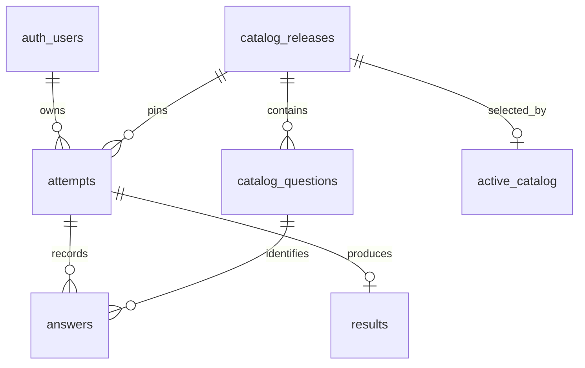

# قرارداد داده و دیتابیس — مرحله ۲

## وضعیت محتوای اولیه

نسخه فعال `0.2.0-pilot` پنج فایل JSON هم‌نسخه با schema 2 دارد؛ نسخه `0.1.0-pilot` آرشیو شده است. ۵۶ سؤال مشترک و ۴ سؤال اختصاصی برای هر گروه وجود دارد؛ در نتیجه هر داوطلب دقیقاً ۶۰ سؤال می‌بیند. ۱۰ خانواده و ۴۳ عنوان از درخواست اولیه وارد شده‌اند: ۲۱ تجربی و ۲۲ ریاضی. شناسه‌های انگلیسی برای اتصال داده پایدارند و عنوان فارسی برای نمایش است.

پروفایل شش رغبت از داده O*NET® 31.0 مشتق شده است؛ انتخاب شغل‌های نمونه برای هر رشته همچنان تحریریه‌ای و نیازمند بازبینی است. سؤال‌های تألیفی و وزن‌های برابر، اعتبارسنجی روان‌سنجی نشده‌اند. `admissionStatus: unverified` یعنی عنوان و امکان پذیرش آن در گروه مربوط با منبع رسمی همان سال بررسی نشده است. `kind: pathway` مسیر یا گرایش است. [بازبینی علمی](scientific-review.md) مرز داده منبع‌دار و فرض طراحی را توضیح می‌دهد.

## قرارداد فایل‌ها

| فایل | محتوای اصلی | نکته اعتبارسنجی |
| --- | --- | --- |
| `questions.json` | شناسه، متن، گروه‌های مجاز، بخش، محور اصلی، اثرها | ۶۰ سؤال برای هر گروه؛ هر محور حداقل دو سؤال اصلی |
| `families.json` | پنج خانواده هر گروه و شش رغبت هدف | برابر میانگین شغل‌های یکتای اعضای خانواده |
| `majors.json` | ۴۳ عنوان، خانواده، نوع، گروه، شغل‌های نمونه و دلیل نگاشت | پروفایل دقیقاً از مقادیر خام منبع محاسبه شود |
| `scoring.json` | مقیاس، محورهای یکتا، روش، وزن‌ها و دروازه شواهد | فقط رغبت در رتبه؛ برابری وزن شش محور؛ انتشار صرفاً pilot |
| `report_templates.json` | بخش‌های گزارش دانش‌آموز و مشاور، برچسب‌ها و متن محدودیت | فقط دو مخاطب و فهرست بخش‌های مشخص |

فرمان بررسی: `node scripts/catalog/validate.mjs`. این برنامه قالب، تعدادها، شناسه‌های یکتا، ارجاع‌ها، پوشش محورها، بازه امتیاز و وزن‌ها را می‌سنجد. بازبینی کیفیت متن، سوگیری سؤال و تأیید عنوان پذیرش نیازمند بررسی انسانی است.

## جدول‌ها و کلیدها

`catalog_releases` نسخه، SHA-256، کپی کامل پنج JSON و وضعیت pilot/published را نگه می‌دارد. `catalog_questions` شناسه، ترتیب و گروه سؤال‌ها را برای کلید خارجی و کنترل سرور جدا می‌کند. نسخه ابتدا بارگذاری و سپس seal می‌شود؛ بعد از seal، محتوا و سؤال‌ها قابل تغییر نیستند. `active_catalog` نسخه مورد استفاده برای آزمون تازه را تعیین می‌کند؛ آزمون‌های قدیمی به نسخه خودشان متصل می‌مانند.

`attempts` مالک، نام نمایشی، سال کنکور شمسی، گروه، نسخه کاتالوگ، وضعیت و revision را دارد. `answers` فقط اعداد ۱ تا ۵ را می‌پذیرد و دو کلید خارجی، تعلق سؤال به نسخه آزمون را تضمین می‌کنند. `results` برای هر آزمون حداکثر یک snapshot دارد. حذف کاربر از Auth رکوردهای عملیاتی او را به صورت آبشاری حذف می‌کند؛ نسخه‌های کاتالوگ باقی می‌مانند.

## عملیات و امنیت

نقش احرازشده فقط رکوردهای خودش را با RLS می‌خواند. نقش `anon` بدون نشست به جدول‌های خصوصی و توابع دسترسی ندارد. کاربران حتی با شناسه آزمون دیگران اجازه خواندن یا نوشتن آن را ندارند. Supabase Anonymous Auth کاربر را در نقش `authenticated` با شناسه `auth.uid()` قرار می‌دهد؛ [تفاوت این حالت با نقش دیتابیسی `anon`](https://supabase.com/docs/guides/database/postgres/row-level-security) در طراحی لحاظ شده است.

نوشتن مستقیم جدول‌ها برای نقش کاربر بسته است. عملیات مجاز از سه RPC محدود انجام می‌شود:

1. `create_attempt`: فقط با هویت معتبر و نسخه فعال seal‌شده؛ نام، سال و گروه بررسی می‌شود.
2. `save_answers`: فقط مالک و وضعیت draft؛ نسخه و گروه سؤال، مقدار ۱ تا ۵ و revision بررسی می‌شود. درخواست قدیمی با خطای تعارض رد می‌شود.
3. `submit_attempt`: کامل بودن پاسخ‌ها را دوباره در دیتابیس بررسی می‌کند و وضعیت را به submitted می‌برد؛ تکرار درخواست همان وضعیت را برمی‌گرداند.

`complete_attempt` فقط برای `service_role` تعریف شده است و snapshot و گذار completed را در یک تراکنش ثبت می‌کند. این کلید نباید در مرورگر یا متغیرهای `NEXT_PUBLIC_` قرار گیرد. تابع‌ها با `security definer`, `search_path` خالی و grant محدود تعریف شده‌اند؛ مطابق [راهنمای امنیت تابع Supabase](https://supabase.com/docs/guides/database/functions). سرویس Matching در مرحله ۴ پیش از فراخوانی، پاسخ‌ها و نسخه را بررسی و نتیجه را می‌سازد.

## اعمال در یک پروژه Supabase

1. Anonymous Sign-Ins را در تنظیمات Auth پروژه فعال کنید.
2. همه migrationهای `supabase/migrations/` را به ترتیب نام اجرا کنید. اگر migration اول قبلاً اعمال شده است، فقط `202609270002_matching_snapshot.sql` را اضافه کنید؛ جدول‌های قبلی را دوباره نسازید.
3. `node scripts/catalog/validate.mjs` و سپس `node scripts/catalog/build-seed.mjs` را اجرا کنید.
4. `supabase/seed.sql` را در همان محیط اجرا کنید. این فایل یک تراکنش واحد است، نسخه را seal می‌کند و به عنوان active برمی‌گزیند. اجرای دوباره همان نسخه با همان hash امن است؛ نسخه یکسان با محتوای متفاوت رد می‌شود.
5. پیش از محیط عمومی، آزمون دسترسی دو کاربر، ثبت و بستن آزمون، و بررسی سیاست‌های RLS را در خود PostgreSQL اجرا کنید.

برای بازاجرای آزمون محلی PostgreSQL، بسته `@electric-sql/pglite` را با `npm install --prefix .db-validation --no-save --package-lock=false @electric-sql/pglite` نصب کنید و `npm test` را اجرا کنید. بسته در Git نادیده گرفته می‌شود. آزمون قدیمی مرحله ۲ با seed آرشیوشده و آزمون Matching با هر دو migration و seed جدید اجرا می‌شوند؛ مالکیت دو نشست، بستن پاسخ، کنترل گروه، ثبات نسخه و ساخت نتیجه واقعی موتور بررسی می‌شوند.

از مرحله ۴ SHA-256 کاتالوگ بر JSON با کلیدهای مرتب محاسبه می‌شود تا تغییر ترتیب در JSONB بی‌اثر باشد. migration دوم نتیجه بدون رتبه برای رغبت‌های مساوی را پشتیبانی و شکل همه رتبه‌ها را کنترل می‌کند. `SUPABASE_SERVICE_ROLE_KEY` فقط در محیط سرور برای ثبت نتیجه لازم است؛ راه‌اندازی در [راهنمای مرحله ۴](matching-stage4.md) آمده است.

در این فضای کاری نشانی پروژه Supabase و کلیدهای آن وجود ندارد؛ migration و seed روی PostgreSQL محلی موقت اجرا شده‌اند، ولی هنوز روی پروژه میزبانی‌شده Supabase اعمال نشده‌اند. قبل از انتشار عمومی، همین آزمون‌های دسترسی باید در محیط توسعه Supabase نیز تکرار شوند. منبع رسمی رشته‌ها و نسخه پرسش‌نامه نیز باید بررسی شوند.
