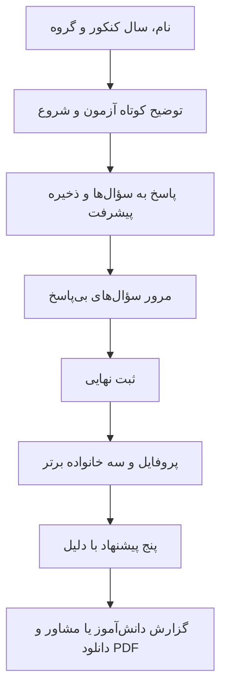

# طراحی MVP انتخاب‌یار

## هدف و مخاطب

دانش‌آموز پایه دوازدهم یا پشت‌کنکوری تجربی و ریاضی بتواند با یک آزمون کوتاه، علاقه‌ها و ترجیحات خود را مرور کند و در صورت متمایز بودن رغبت‌ها، سه خانواده و پنج مسیر تحصیلی برای بررسی بیشتر بگیرد. برای پروفایل یکنواخت پیشنهاد رتبه‌دار ساخته نمی‌شود. معیار موفقیت محصول، تکمیل مسیر و قابل‌فهم بودن پیشنهادهاست؛ ادعای پیش‌بینی قبولی یا موفقیت تحصیلی نداریم. وضعیت علمی فعلی در [بازبینی مرحله ۴](scientific-review.md) آمده است.

## محدوده نسخه اول

| قابلیت | رفتار مورد انتظار |
| --- | --- |
| اطلاعات اولیه | نام نمایشی، سال کنکور شمسی، یکی از دو گروه تجربی یا ریاضی |
| آزمون | هدف طراحی ۶۰ سؤال کوتاه با پاسخ پنج‌گزینه‌ای؛ امکان کاهش تا ۵۰ پس از بازبینی کیفیت و پوشش |
| مسیر اختصاصی گروه | پرسش‌نامه منتشرشده متناسب با گروه و بانک پیشنهاد همان گروه؛ سؤال‌های مشترک قابل استفاده در هر دو گروه |
| ادامه آزمون | بازگشت به سؤال قبلی، ذخیره پاسخ‌ها و ادامه در همان مرورگر با نشست معتبر |
| پروفایل | عنوان توصیفی قابل توضیح، امتیازهای محورها و توضیح کوتاه |
| پیشنهاد | سه خانواده برتر و پنج پیشنهاد از همان گروه، همراه درصد تناسب، دلیل و موارد قابل بررسی |
| گزارش دانش‌آموز | نتیجه خوانا و قابل دانلود در PDF |
| گزارش مشاور | نمایش تفصیلی امتیازها و رتبه‌بندی‌ها، قابل دانلود توسط صاحب آزمون برای ارائه به مشاور |

پنل اختصاصی مشاور، حساب مدرسه، پرداخت، OTP، آزمون هوش عملکردی، رتبه کنکور، نمره، سهمیه، دانشگاه و انتخاب رشته رسمی در محدوده این MVP نیستند. گزارش مشاور در این نسخه نوعی گزارش است؛ نقش کاربری با دسترسی عمومی به نتایج دانش‌آموزان ایجاد نمی‌کند.

## جریان اصلی

تغییر گروه پس از شروع، آزمون تازه‌ای ایجاد می‌کند تا سؤال‌ها، نسخه‌ها و پیشنهادهای دو مسیر مخلوط نشوند. پس از ثبت نهایی، پاسخ‌ها ثابت می‌مانند؛ تکرار آزمون یک اجرای تازه است.

## طرح صفحه‌ها

### ورود اطلاعات — `/`

نام محصول، یک توضیح کوتاه، نام نمایشی، سال کنکور و دو کارت انتخاب گروه در بخش اصلی صفحه قرار می‌گیرند. دکمه «شروع آزمون» پس از تکمیل ورودی معتبر فعال می‌شود. ارقام فارسی و لاتین پذیرفته و در ذخیره‌سازی یکسان می‌شوند. سال کنکور از تنظیمات نسخه می‌آید و ثابت در رابط نوشته نمی‌شود.

### آزمون — `/assessment/[attemptId]`

یک سؤال در هر کارت، پنج گزینه دارای برچسب کامل، دکمه‌های «قبلی» و «بعدی» و پیشرفت مانند «۱۲ از ۶۰» نمایش داده می‌شوند. گزینه ۳ با عنوان روشن «نه موافقم، نه مخالفم» نمایش می‌یابد و مقدار عددی آن همان ۳ است. هیچ گزینه‌ای از قبل انتخاب نمی‌شود. انتخاب پاسخ خودکار صفحه را عوض نمی‌کند.

پیشرفت از تعداد پاسخ‌های ثبت‌شده محاسبه می‌شود. وضعیت «در حال ذخیره»، «ذخیره شد» و «ذخیره نشد، تلاش دوباره» قابل تشخیص است. پاسخ ذخیره‌نشده هنگام قطعی در حافظه همان صفحه می‌ماند؛ ادامه آفلاین کامل در محدوده MVP نیست و خروج از صفحه پیش از ذخیره می‌تواند آن پاسخ را از دست بدهد.

### نتیجه — `/results/[attemptId]`

ترتیب محتوا: عنوان پروفایل، سه خانواده، پنج کارت پیشنهاد، توضیح امتیاز تناسب، دکمه گزارش. در هر کارت دلیل‌ها به محورهای واقعی پاسخ فرد متصل‌اند. عدد تناسب، احتمال قبولی یا تضمین موفقیت معرفی نمی‌شود. اختلاف‌های کوچک امتیاز به عنوان برتری قطعی تفسیر نمی‌شوند.

### گزارش تفصیلی — `/results/[attemptId]/report`

نمایش دانش‌آموز و مشاور از همان snapshot نتیجه ساخته می‌شوند. نمایش مشاور شامل تمام امتیازها، پوشش سؤال‌ها، رتبه تمام خانواده‌ها و مسیرهای واجد شرایط، دلیل‌ها و محدودیت تفسیر است. رتبه‌بندی کامل رشته‌ها از فهرست کوتاه پنج‌تایی قابل تفکیک است.

## حالت‌های ضروری

| حالت | رفتار |
| --- | --- |
| سؤال بی‌پاسخ | نمایش تعداد و امکان رفتن مستقیم به سؤال؛ ثبت نهایی مسدود |
| شبکه قطع یا خطای ذخیره | حفظ پاسخ فعلی در صفحه، امکان تلاش مجدد؛ بدون اعلام موفقیت کاذب |
| آزمون ثبت‌شده | بازگشت به نتیجه به جای ویرایش پاسخ |
| نشست نامعتبر | توضیح عدم دسترسی؛ نام یا شناسه آزمون راه بازیابی نیست |
| نتیجه در حال محاسبه یا خطای محاسبه | وضعیت روشن و تلاش مجدد امن بدون ساخت نتیجه تکراری |
| خطای PDF | نتیجه وب در دسترس می‌ماند و دانلود قابل تکرار است |

## جهت بصری و دسترس‌پذیری

رابط آرام و واضح با زمینه روشن، متن سرمه‌ای و آبی برای عمل اصلی؛ تأکید روی سؤال و انتخاب‌های بزرگ. فونت محلی فارسی با مجوز مناسب، متن اصلی حداقل ۱۶ پیکسل، فاصله مناسب سطرها، کنترل لمسی حدود ۴۴ پیکسل و فوکوس واضح. رنگ تنها راه بیان انتخاب یا خطا نیست. گزینه‌ها radio واقعی با دسترسی صفحه‌کلید هستند؛ نوار پیشرفت برچسب متنی دارد و حرکت‌ها با ترجیح کاهش انیمیشن سازگارند.

بازبینی رابط در عرض ۳۶۰ پیکسل، صفحه دسکتاپ، بزرگ‌نمایی ۲۰۰٪ و با صفحه‌کلید جزو معیار پذیرش مرحله ۳ است. زمان آزمون پس از پایلوت اندازه‌گیری می‌شود؛ پیش از آن زمان قطعی به کاربر وعده داده نمی‌شود.
